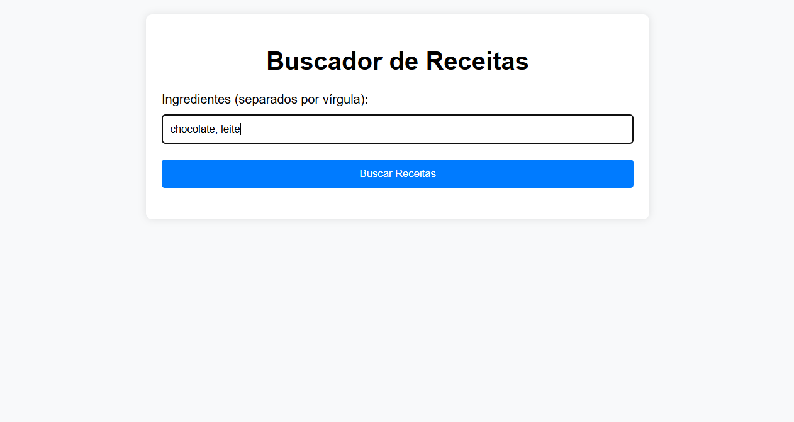
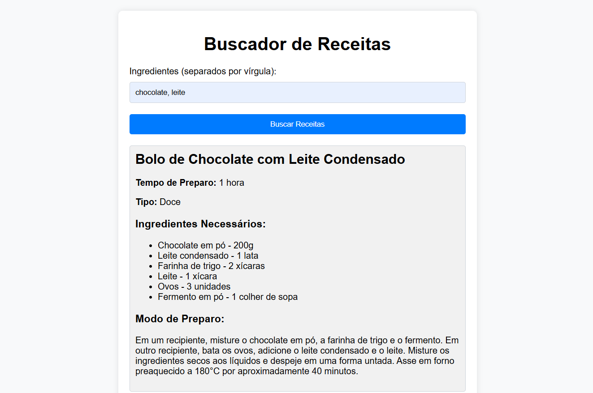

# Buscador de Receitas

Esta é uma aplicação web que utiliza a API do OpenAI para sugerir receitas com base em uma lista de ingredientes fornecida pelo usuário. A aplicação é construída com Flask e inclui uma interface web simples para interação.

## Índice

- [Visão Geral](#visão-geral)
- [Configuração](#configuração)
- [Rodando a Aplicação](#rodando-a-aplicação)
- [Uso](#uso)
- [Estrutura do Projeto](#estrutura-do-projeto)
- [Dependências](#dependências)
- [Integração com a API](#integração-com-a-api)

## Visão Geral

A aplicação recebe uma lista de ingredientes através de um formulário na interface web. Com base nos ingredientes fornecidos, a aplicação consulta a API do OpenAI para gerar sugestões de receitas e exibe os resultados ao usuário.

## Configuração

### Pré-requisitos

- Python 3.7 ou superior
- Conta na OpenAI e uma chave de API

### Passos de Configuração

1. **Clone o repositório:**

    ```bash
    git clone https://github.com/seuusuario/repositorio.git
    cd repositorio
    ```

2. **Crie um ambiente virtual:**

    ```bash
    python -m venv venv
    source venv/bin/activate  # No Windows use `venv\Scripts\activate`
    ```

3. **Instale as dependências:**

    ```bash
    pip install -r requirements.txt
    ```

4. **Configure a variável de ambiente para a chave da API OpenAI:**

    Crie um arquivo `.env` na raiz do projeto e adicione a sua chave de API:

    ```plaintext
    OPENAI_API_KEY=your_openai_api_key
    ```

    Alternativamente, você pode exportar a variável de ambiente diretamente no terminal:

    ```bash
    export OPENAI_API_KEY=your_openai_api_key
    ```

## Rodando a Aplicação

1. **Inicie o servidor Flask:**

    ```bash
    flask --app recipes run
    ```

2. **Acesse a aplicação:**

    Abra o navegador e vá para `http://localhost:5000/`.

## Uso

1. Na página inicial, insira uma lista de ingredientes separados por vírgula no campo de entrada e Clique no botão "Buscar Receitas".
   

2. A aplicação irá exibir até duas receitas sugeridas que utilizam os ingredientes fornecidos.
   
## Estrutura do Projeto

```
.
├── recipes.py
├── templates
│   └── index.html
├── static
│   └── styles.css
├── requirements.txt
└── README.md
```

- `recipes.py`: Script principal que contém a lógica do servidor Flask e as rotas.
- `templates/index.html`: Template HTML para a interface web.
- `static/styles.css`: Arquivo CSS para estilização da interface.
- `requirements.txt`: Arquivo contendo as dependências do projeto.
- `README.md`: Este arquivo de documentação.

## Dependências

- Flask: Microframework para desenvolvimento web em Python.
- OpenAI: Biblioteca para interação com a API do OpenAI.

Para instalar as dependências, execute:

```bash
pip install -r requirements.txt
```

## Integração com a API

Para integrar-se com a API de receitas, você pode fazer uma requisição POST para o endpoint `/recipes` com uma lista de ingredientes em formato JSON.

### Exemplo de Requisição

```bash
curl --request POST \
  --url http://localhost:5000/recipes \
  --header 'Content-Type: application/json' \
  --data '{
	"ingredientes": [
		"chocolate",
		"leite"
	]
}'
```

### Exemplo de Resposta

```
[
  {
    "id": "1",
    "nome": "Bolo de Chocolate com Leite Condensado",
    "ingredientes_necessarios": [
      {"nome": "Chocolate em pó", "quantidade": "1 xícara"},
      {"nome": "Leite condensado", "quantidade": "1 lata"},
      {"nome": "Farinha de trigo", "quantidade": "2 xícaras"},
      {"nome": "Leite", "quantidade": "1 xícara"},
      {"nome": "Ovos", "quantidade": "3 unidades"},
      {"nome": "Fermento em pó", "quantidade": "1 colher de sopa"}
    ],
    "modo_de_preparo": "Misture todos os ingredientes em um recipiente, despeje em uma forma untada e leve ao forno preaquecido a 180°C por cerca de 40 minutos. Deixe esfriar e sirva.",
    "tempo_de_preparo": "1 hora",
    "tipo": "Doce"
  },
  {
    "id": "2",
    "nome": "Chocolate Quente Cremoso",
    "ingredientes_necessarios": [
      {"nome": "Chocolate em barra", "quantidade": "200g"},
      {"nome": "Leite", "quantidade": "500ml"},
      {"nome": "Açúcar", "quantidade": "4 colheres de sopa"},
      {"nome": "Creme de leite", "quantidade": "1 caixinha"}
    ],
    "modo_de-preparo": "Derreta o chocolate em barra em banho-maria, adicione o leite e o açúcar, mexendo bem até ferver. Desligue o fogo, acrescente o creme de leite e mexa até obter uma mistura homogênea. Sirva quente.",
    "tempo_de_preparo": "20 minutos",
    "tipo": "Doce"
  }
]

```
